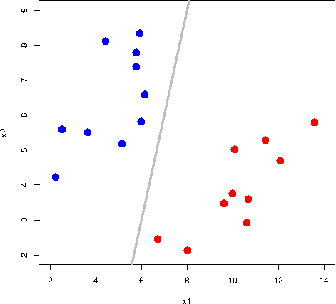

 
  

<h1 align="center"> Atención hospitalaria de pacientes con COVID-19 </h1>

<h3 align="center"> ¿Podemos predecir los pacientes que necesitarán atención en UCI a partir de los datos de ingreso a hospitalización?</h3>
<h5 align="center"> Proyecto Final - </h5>

 

<h2 align="center"> 
Bienvenidos al Proyecto de Uso de Técnicas de Machine Learning para predecir el ingreso a UCI en pacientes con COVID-19</h2>

Exploraremos los datos de pacientes que han sido hospitalizados por COVID-19 en cuatro clínicas en diferentes ciudades de Colombia. Estos datos incluyen detalles demográficos, síntomas al momento del ingreso, variables de examen físico, clasificaciones clínicas.

Posteriormente se modelarán los datos y se realizarán experimentos con modelos de Machine learning para clasificación, que permitan predecir el ingreso a UCI a partir de las variables descritas. 

<h2 >Objetivos</h2>

Dado que COVID-19 es una enfermedad reciente, la clasificación clínica y pronóstico estaban limitados al conocimiento que se tenía de otras patologías similares, tales como las neumonías bacterianas o virales. Una adecuada clasificación de los pacientes con COVID-19 al momento del ingreso a hospitalización permite a los profesionales de la salud identificar pacientes de alto riesgo que requieren cuidados intensivos o intervenciones especializadas en las primeras etapas del curso de la enfermedad. Además, ayuda a asignar recursos de manera eficiente, garantizando que las UCI estén disponibles para quienes más las necesitan. 

De esta manera, comprender los perfiles clínicos de los pacientes con COVID-19 (6) así como predecir su curso clínico y desenlaces duros (como ingreso a UCI) se hace crucial (7). En el contexto del COVID-19 y otras patologías infectocontagiosas, el aprendizaje automático puede jugar un papel importante, por ejemplo, ayudando en la detección y diagnósticos tempranos, prediciendo la progresión de la enfermedad y sus desenlaces, facilitar el descubrimiento de nuevos medicamentos o identificando los subtipos clínicos dentro de la población, ayudando a adaptar los planes de tratamiento a las necesidades individuales.

Nuestra meta es elaborar un tablero para visualización de datos, así como un modelo de machine learning que será desplegado como prototipo funcional. Esto podría ser valioso para ajustar los tratamientos iniciales según las predicciones. 

<h2 >Potenciales Partes Interesadas </h2>

Varios actores podrían encontrar este análisis beneficioso, incluyendo:

  <ul>
      <li>Clínicas y hospitales (públicos y privados)</li>
      <li>Administradores de planes de beneficios de salud</li>
      <li>Consortios de prestadores de servicios de salud</li>
      <li>Profesionales médicos, enfermeras y personal de salud</li>
      <li>Pacientes</li>
      <li>Comunidad en general</li>
  </ul>

 

Muchos de estos actores podrían ser clientes directos interesados en implementar procesamientos y análisis similares en sus instituciones. 

  
  

 En este proyecto, la fuente de datos consiste en cuatro clínicas privadas en Colombia. La información se obtuvo con la aprobación institucional y la autorización de un comité de ética en investigación.

<h2>Metodología</h2>

El alcance del proyecto involucra básicamente lograr contar con un modelo de machine learning que realice predicción de ingreso a UCI con estos datos de ingreso a hospitalización. Sería una herramienta de apoyo para los médicos y demás profesionales de la salud, que, junto con la evaluación clínica, podrían saber si el paciente va a requerir una cama en UCI, lo que permitirá planificar mejor el curso de atención de los pacientes y la utilización de recursos e insumos.
Proyectos similares han sido realizados en otras partes del mundo, contando con buenos resultados con algoritmos como XGBoost (7, 8), Support vector machine (SVM) (9, 10), random forest (11), entre otros (7, 12).

Consideraremos lo siguiente para el modelado de datos:
<ul>
  <li>La predicción se debe realizar a partir de datos clínicos de ingreso (edad, sexo, ciudad, variables antropométricas, síntomas, clasificaciones clínicas o valores de laboratorio). </li>
  <li>No se deben considerar variables que se presenten durante el seguimiento de la hospitalización (tales como las complicaciones).</li>
  <li>No se deben considerar pacientes con COVID-19 nosocomial, por considerar que sus características de ingreso serían diferentes a los pacientes usuales atendidos desde los servicios de urgencias.</li>
  <li>Como desenlace se buscará predecir el ingreso a UCI.</li>
</ul>

Para este proyecto, consideraremos algoritmos de clasificación tales como XGBoost, ADABoost y Random Forest.

 

La elección del algoritmo final dependerá de la evaluación de los resultados en base a métricas establecidas por el equipo de trabajo.

<h2>Bibliografía</h2>
<ul>
  <li><b>1. Dong E, Du H, Gardner L.</b> An interactive web-based dashboard to track COVID-19 in real time. Lancet Infect Dis. 2020;20(5):533-4.</li>
  <li><b>2. Collaborators C-CI</b>. Estimating global, regional, and national daily and cumulative infections with SARS-CoV-2 through Nov 14, 2021: a statistical analysis. Lancet. 2022;399(10344):2351-80.</li>
  <li><b>3. Lin C-T, Bookman K, Sieja A, Markley K, Altman RL, Sippel J, et al. </b>Clinical informatics accelerates health system adaptation to the COVID-19 pandemic: examples from Colorado. Journal of the American Medical Informatics Association. 2020;27(12):1955-63.</li>
  <li><b>4. Merette K, Awad M, Hamid R.</b> Building resilient hospitals in the Eastern Mediterranean Region: lessons from the COVID-19 pandemic. BMJ Global Health. 2022;7(Suppl 3):e008754.</li>
  <li><b>5. Staffolani S, Iencinella V, Cimatti M, Tavio M.</b> Long COVID-19 syndrome as a fourth phase of SARS-CoV-2 infection. Infez Med. 2022;30(1):22-9.</li>
  <li><b>6. Saavedra Trujillo CH</b>. ADENDO: ACTUALIZACIÓN 27/06/2020. Consenso colombiano de atención, diagnóstico y manejo de la infección por SARS-CoV-2/COVID-19 en establecimientos de atención de la salud: Recomendaciones basadas en consenso de expertos e informadas en la evidencia ACIN-IETS. SEGUNDA EDICIÓN. Infectio. 2020;24(3).</li>
  <li><b>7. Mirfazeli FS, Sarabi-Jamab A, Jahanbakhshi A, Kordi A, Javadnia P, Shariat SV, et al.</b> Neuropsychiatric manifestations of COVID-19 can be clustered in three distinct symptom categories. Scientific Reports. 2020;10(1):20957.</li>
  <li><b>8. Otake S, Chubachi S, Namkoong H, Nakagawara K, Tanaka H, Lee H, et al.</b> Clinical clustering with prognostic implications in Japanese COVID-19 patients: report from Japan COVID-19 Task Force, a nation-wide consortium to investigate COVID-19 host genetics. BMC Infectious Diseases. 2022;22(1):735.</li>
  <li><b>9. Fernández-de-las-Peñas C, Martín-Guerrero JD, Florencio LL, Navarro-Pardo E, Rodríguez-Jiménez J, Torres-Macho J, et al.</b> Clustering analysis reveals different profiles associating long-term post-COVID symptoms, COVID-19 symptoms at hospital admission and previous medical co-morbidities in previously hospitalized COVID-19 survivors. Infection. 2023;51(1):61-9.</li>
  <li><b>10. San-Cristobal R, Martín-Hernández R, Ramos-Lopez O, Martinez-Urbistondo D, Micó V, Colmenarejo G, et al.</b> Longwise Cluster Analysis for the Prediction of COVID-19 Severity within 72 h of Admission: COVID-DATA-SAVE-LIFES Cohort. Journal of Clinical Medicine. 2022;11(12):3327.</li>
  <li><b>11. Hu F, Huang M, Sun J, Zhang X, Liu J. </b>An analysis model of diagnosis and treatment for COVID-19 pandemic based on medical information fusion. Information Fusion. 2021;73:11-21.</li>
  <li><b>12. Pezoulas VC, Kourou KD, Mylona E, Papaloukas C, Liontos A, Biros D, et al.</b> ICU admission and mortality classifiers for COVID-19 patients based on subgroups of dynamically associated profiles across multiple timepoints. Computers in Biology and Medicine. 2022;141:105176.</li>
  <li><b>13. Han L, Shen P, Yan J, Huang Y, Ba X, Lin W, et al.</b> Exploring the Clinical Characteristics of COVID-19 Clusters Identified Using Factor Analysis of Mixed Data-Based Cluster Analysis. Frontiers in Medicine. 2021;8.</li>
  <li><b>14. Rodríguez A, Ruiz-Botella M,  Martín-Loeches I, Jimenez Herrera M, Solé-Violan J, Gómez J, et al.</b> Deploying unsupervised clustering analysis to derive clinical phenotypes and risk factors associated with mortality risk in 2022 critically ill patients with COVID-19 in Spain. Critical Care. 2021;25(1):63.</li>
</ol>

<h2 id="integrantes">Integrantes</h2>

<ul>
  <li><strong>Andrés Gaviria</strong></li>
  <li><strong>Luis Daza</strong></li>
  <li><strong>Eniver Pino </strong></li>
  <li><strong>Denisse Trujillo</strong> </li>
</ul>
